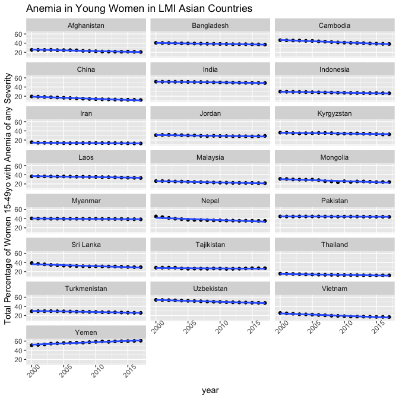
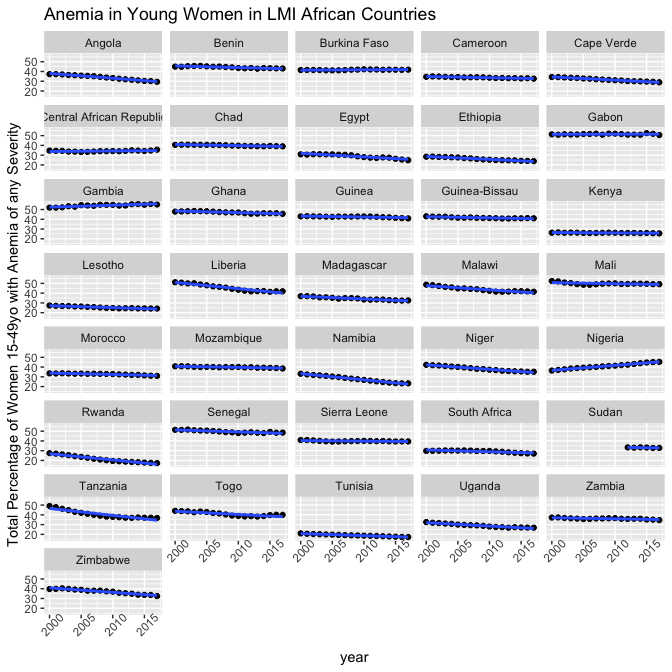

Midterm
================
Sylvia Baeyens,
due 10/22/2021

# Introduction

This midterm project will look at the relationship between meat
consumption and anemia prevalance in low and middle income countries.

Anemia is one of the most common medical conditions among menopausal
women. Anemia is defined as a condition where the body lacks enough red
blood cells to carry sufficient oxygen. Anemia is associated with many
health risk factors and increased fatigue.

The main cause of anemia is iron deficiency. Iron is required to produce
hemoglobin, a protein in red blood cells which binds to oxygen. Another
secondary cause of anemia is blood loss, which occurs cyclically,
usually monthly, in menopausal women; therefore, menopausal women are at
an increased risk for anemia.

Iron can be consumed through diet in two forms: heme and non-heme iron.
Heme iron is found only in animal products, such as red meat and
poultry. Non-heme iron is plant based, and can be found in food sources
such as nuts, legumes, and leafy greens. Heme iron is more readibly
absorbed by the body than non-heme iron; non-heme iron often requires
secondary vitamins, such as vitamin C, to upregulate proper absorption.
While it is certainly possible to avoid an iron deficiency on a
plant-based diet, most plant-based individuals choose to supplement
their diet with iron supplements.

This midterm will focus solely on lower and middle income countries, as
information on proper diet and supplementation is not readily available
to these populations and the economic burden of anemia is greater.

# Methods

In order to answer the main question, multiple data sets were acquired
from various sources. The data can be organized into 3 categories:
anemia data, meat consumption data, and country data.

## Anemia Data

The data sets related to the prevalence of anemia in 15-49 year old
women in low and middle income countries (LMIC) were exported from
ghdx.healthdata.org. This data was collected by the Institute of Health
Metrics and Evaluation with the funding from the Bill and Melinda Gates
Foundation between January 2000 and December 2019. It was published in
2021. There were three different csv files in this set, one for mild
anemia, one for moderate anemia, and one for severe anemia. The
thresholds for these distinctions can be found in the paper *“Anemia
prevalence in women of reproductive age in low- and middle-income
countries between 2000 and 2018”*, published in **Nature Medicine** in
2021, and they vary between pregnant and non-pregnant women. The data
sets detailed the prevalence of each kind of anemia every year in 82
LMICs at a 5x5km level. These csv’s were downloaded from the site
manually and read into data tables in the R code. From there, variable
names were changed to improve ease of merging. Instead of keeping the
data at the 5x5km level, the mean anemia prevalence was found by country
and year. Finally, the three data tables (moderate, mild, and severe)
were merged into the data table “TotalAnemia”. This table included all
82 countries and the mild, moderate, and severe percentages of anemia
prevalence for every year from 2000 to 2019. No values were found to be
missing or unreasonable.

## Meat Consumption Data

The data set related to meat food supply quantity in terms of kilograms
per capita per year was exported from ourworldindata.org. This data was
sourced from data published by the United Nations Food and Agricultural
Organization (FAO) in 2020. The data was collected from 1961 to 2017.
This csv file was also exported manually from the website and read into
a data table within the R code. It contains data from 215 countries and
was not found to have any missing values. The data only had 4 variables:
the country name, 3 letter country code, year, and meat food supply
quantity; these variables were renamed for ease of use and to match the
names of the anemia data table.

## Country Data & Final Data Table

Following preliminary data cleanup and wrangling, the TotalAnemia and
meatData data tables were merged together by country and year to create
a new data table: TotalData. All observations from the TotalAnemia data
table were kept. To add a final level of analysis, a country code data
set was downloaded and read in by the R code. This csv file was found on
datahub.io, and lists every country, along with its three letter country
code, continent, and other identifying information; only the three
letter code and continent were selected for. This country code data set
was then merged with the TotalData set by code, so that every
observation now included the continent as well.

Final data cleanup and wrangling was now performed. Any observations
missing meat consumption values were removed. The data table was now
left with data for 69 LMICs, for a total of 1258 observations. When
looking at summaries and visualizations of the various variables, no
data looked unreasonable. The data was now ready for further exploration
via visualization, as seen in the preliminary results section.

# Preliminary Results

(provide summary statistics in tabular form and publication-quality
figures, take a look at the kable function from knitr to write nice
tables in Rmarkdown)

The results of the summary statistics viewed following data clean up for
the 4 variables of interest in the TotalData data table are printed
below. It is important to note that this data table only includes 69 Low
& Middle Income Countries (LMICs) are explained above. It is known that
including counties such as the United States or the UK would increase
all values for meat consumption in kilograms per capita.

| consumption | mild\_anemia\_percentage | moderate\_anemia\_percentage | severe\_anemia\_percentage |
|------------:|-------------------------:|-----------------------------:|---------------------------:|
|       2.790 |                0.0622677 |                    0.0243576 |                  0.0008969 |
|      12.300 |                0.1261958 |                    0.1084639 |                  0.0062583 |
|      18.765 |                0.1729187 |                    0.1514557 |                  0.0112407 |
|      34.860 |                0.1901257 |                    0.2072797 |                  0.0167453 |
|     100.680 |                0.2536185 |                    0.3556498 |                  0.0535393 |

**Quantiles (minimum, 25%, median, 75%, maximum) for Selected Variables
in TotalData data frame**

The values for mild and anemia prevalence appear very similar, while the
prevalence of severe anemia is much lower. For all further visualization
and analysis, these three percentages will be summed to find the total
percentage of women in each country between the ages of 15 and 49 with
anemia.

The first step in visualizing data was viewing trends in total anemia
prevalence for every country. To do this, the prevalence of mild,
moderate, and severe anemia were summed together for every year and
country. This data is visualized below, separated into the various
continents represented for ease of viewing. A trend line was applied to
each plot. This visualization was done to see if there are any trends
over time of anemia prevalence.

<!-- --><!-- -->

<!-- -->

From these 3 graphs, it does appear that during the time period between
2000 and 2017, the prevalence of anemia decreased very slightly in the
majority of these LMICs, as shown by the slight negative slope of the
best fit trend line. The total percentage of women between the ages of
15-49 with anemia ranges from 10-60%, depending on the country.

Next, the average meat consumption in terms of kilograms per capita and
the average anemia prevalence between the years of 2000 and 2017 was
found for each country. This was done to compare meat consumption and
anemia prevalence between these various countries.

<!-- --><!-- -->

As confirmed in previous graphs and tables, meat consumption ranged
between 5 and 95 kilograms of meat per capita per year while total
anemia prevalence ranged from 10 to 60%. Some trends that can be seen
from the two graphs above include that South and North American
countries have a high consumption of meat while most African countries
have a lower meat consumption. The countries with the lowest meat
consumption include the Asian countries of India, Sri Lanka, and
Bangladesh, countries where vegetarianism is a main component of the
prevalent cultures and religion. The African countries appear to have
higher prevalence of anemia, while the 5 countries with the lowest
prevalence of anemia are all North or South American.

Finally, we looked at the relationship between meat consumption and
anemia prevalance in a scatter plot, where anemia prevalance is on the y
axis and meat consumption is on the x axis. Color was based on
continent, to confirm trends noted in the paragraphs above. Each of the
1248 points represents one country at one year.
<!-- -->

From this plot, there appears to be a large negative linear relationship
between meat consumption and anemia prevalance in LMICs. As meat
consumption increases in a country, the prevalance of anemia decreases.
Most African countries have low values for meat consumption per capita
and high prevalance of anemia. Many South American countries have higher
values for meat consumption and a lower prevalance of anemia. There are
not many points which fall directly on the best fit line or in its
immediate vicinity, indicating that the correlation might not be that
large or that there are many outliers.

The final level of analysis included computing the correlation
coefficients between the prevalance of various severieties of anemia and
meat consumption. These coefficients are shown in the table below.

| Mild Anemia | Moderate Anemia | Severe Anemia |
|------------:|----------------:|--------------:|
|  -0.4129967 |      -0.4320308 |    -0.3515256 |

**Correlation Coefficients between Prevalance of various Severities of
Anemia & Meat Consumption**

The values in the above table confirm the negative relationship between
meat consumption and anemia prevalence, apparent in all 3 types of
anemia. As the magnitude of these 3 coefficients fall between0.3 and
0.5, they indicate a low correlation.

# Conclusion

Based on the data presented above, there is a low negative correlation
between meat consumption and anemia prevalance. There are likely many
other factors affecting the high levels of anemia found in these LMICs,
some of which are also related to diet. Further research could look at
other factors, such as the consumption of other minerals and vitamins or
the prevalence of other blood and digestive-related diseases.

It is positive to see that the prevalance of anemia is slowly
decreasing, and it would be interesting to look into why this is
occuring as well.

Comparing these results to those of more prosperous countries could be a
final direction for this research to go into.
