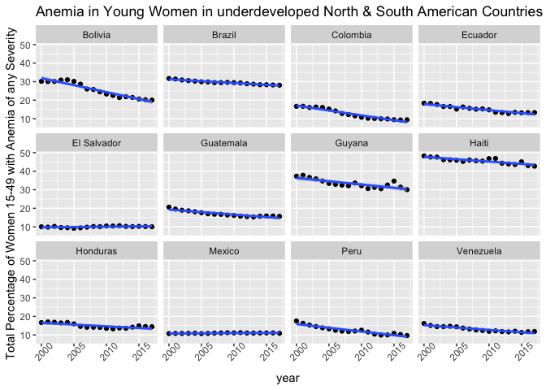
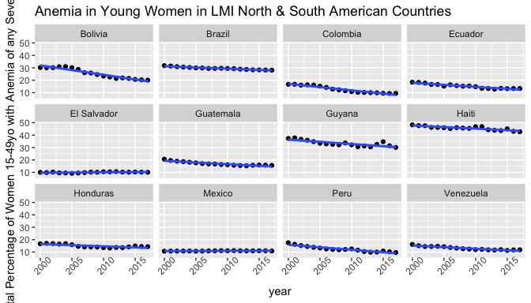

Midterm
================
Sylvia Baeyens
due 10/22/2021

## Introduction

## Methods

## Preliminary Results

``` r
ggplot(TotalData,aes(x=consumption, y=(mildPct+modPct+sevPct)*100)) +
  geom_point() +
  geom_smooth(method= "lm") +
  ggtitle("Visualizing the Relationship between Anemia & Meat Consumption in Underdeveloped Countries")+
  ylab('Total Percentage of Women 15-49 with Anemia of any Severity')+
  xlab('Meat Consumption (kg/capital/year')
```

    ## `geom_smooth()` using formula 'y ~ x'

<!-- -->

``` r
TotalData %>%
  filter("Asia"== CONTINENT) %>%
  ggplot(aes(x=year, y=(mildPct+modPct+sevPct)*100)) +
    facet_wrap(~COUNTRY, nrow= 8) +
    geom_point() +
    geom_smooth(method= "lm")+
    ggtitle("Anemia in Young Women in underdeveloped Asian Countries")+
    theme(axis.text.x = element_text(angle = 45))+
    ylab('Total Percentage of Women 15-49 with Anemia of any Severity')
```

    ## `geom_smooth()` using formula 'y ~ x'

<!-- -->

``` r
TotalData %>%
  filter("Africa"== CONTINENT) %>%
  ggplot(aes(x=year, y=(mildPct+modPct+sevPct)*100)) +
    facet_wrap(~COUNTRY, nrow= 8) +
    geom_point() +
    geom_smooth(method= "lm")+
    ggtitle("Anemia in Young Women in underdeveloped African Countries")+
    theme(axis.text.x = element_text(angle = 45))+
    ylab('Total Percentage of Women 15-49 with Anemia of any Severity')
```

    ## `geom_smooth()` using formula 'y ~ x'

<!-- -->

``` r
TotalData %>%
  filter("South America"== CONTINENT) %>%
  ggplot(aes(x=year, y=(mildPct+modPct+sevPct)*100)) +
    facet_wrap(~COUNTRY, nrow= 3) +
    geom_point() +
    geom_smooth(method= "lm")+
    ggtitle("Anemia in Young Women in underdeveloped South American Countries")+
    theme(axis.text.x = element_text(angle = 45))+
    ylab('Total Percentage of Women 15-49 with Anemia of any Severity')
```

    ## `geom_smooth()` using formula 'y ~ x'

<!-- -->

``` r
TotalData %>%
  filter("North America"== CONTINENT) %>%
  ggplot(aes(x=year, y=(mildPct+modPct+sevPct)*100)) +
    facet_wrap(~COUNTRY, nrow= 3) +
    geom_point() +
    geom_smooth(method= "lm")+
    ggtitle("Anemia in Young Women in underdeveloped North American Countries")+
    theme(axis.text.x = element_text(angle = 45))+
    ylab('Total Percentage of Women 15-49 with Anemia of any Severity')
```

    ## `geom_smooth()` using formula 'y ~ x'

<!-- -->

``` r
#looking at averages for each country

TotalDataAvg = TotalData[,.(
  consumption = mean(consumption,na.rm = TRUE),
  mildPct = mean(mildPct,na.rm = TRUE),
  modPct = mean(modPct,na.rm = TRUE),
  sevPct = mean(sevPct,na.rm = TRUE)
),by = "COUNTRY"]

TotalDataAvg %>%
  arrange(consumption) %>%
  ggplot(aes(x=consumption, y=COUNTRY))+
  geom_bar(stat= "identity") 
```

<!-- -->

## Conclusion
